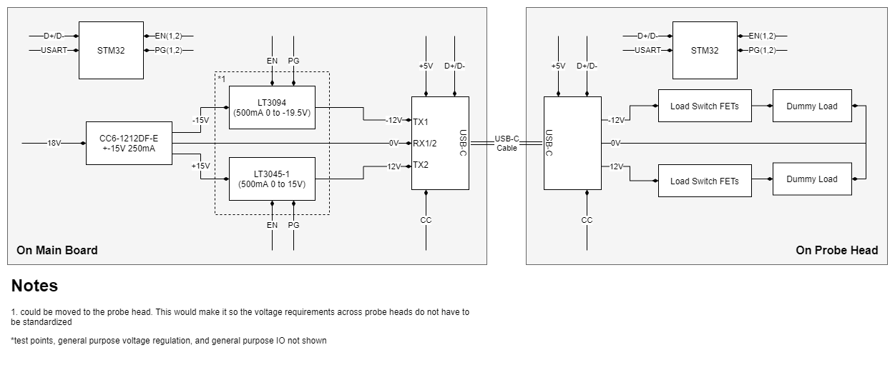

## Probe PSU Design Requirements
- provide +/- rails to the active probe head and have the ability to control the state of these rails
- use a standard low cost off the shelf cable that has differnt avalibilites in length
- provide required intelegence and communication for control of active probe analog components
- provide a test load in the prototype design to simulate the load on the rails. 
- +/- Voltage range (not yet known) developing around 7V  to 12V
- current supply 250mA per rail (not yet known, leaning on the high side)
- USART communication to main CPU
- The STM32 should be able to provide information about the probe to the mainboard. EEPROM emulation can be used to hold device information
- If a user plugs a non-probe device into the port the power rails will not be activated. 

### Methodology & Usage
The USB-C cable will be plugged into the main board. Initally main board will provide +5V on the USB-C cable. When plugged into the probe head the USB-C cable will negotiate with the probe. If negotiations are successful the main board will provide +/- the rail supply voltage on TX1+ and TX2+.

### Main Components
- **Controller (both ends):** STM32 (part not yet picked), with USB.
- **USB-C Connector:** 12401832E402A Amphenol
- **Main Rails Power Supply:** CC6-1212DF-E (different output power options available)
- **Posative ulNoise Regulator:** LT3045-1
- **Negative ulNoise Regulator:** LT3094

### Discussion
- the USB-C cables that have the full set of connections are not always that flexible. This may interfear with ease of use. Another alternative would be to use an M8-6 cable. These do not have twisted pairs so a new protocol would have to be adopted. Also these cables are not as redily avaible and are a bit more expensive. 
- another alternative to reduce design cost is to have the master look at the voltage across the CC pins and supply power if this matches the requirements. However this is not fool proof because any device with the same CC resistor configuraiton could be a false posative. 
- using the EN pin on the regulator provides a load switch with no external required descretes. 
- there is the potential to have the output voltage variable using the LT30xx parts. 
- later there is the potential to remove the STM32 and use the scope host controller if extra USB lains and IO exist.
- for a multichannel system the USARTs can be muxed to the main controller if we are short USARTs
- once the probe has been detected and activated no communication on USB is required. This will reduce the amount of garbadge that couples to the power rails.
- if the USB-C connectors are connected to an internal hub and then into the main CPU these ports could still be used for general purpose USB devices. 

##TODO
- [ ] generate all footprints and symbols not in kicad standard libs
- [ ] create schematic
- [ ] create PCB layout
- [ ] order, build and proto boards
- [ ] create firmware for probe head and main board stm32